# CI/CD Pipeline with AWS EKS, ECR & GitHub Actions

## Project Overview

This project demonstrates a complete **CI/CD pipeline** where application changes pushed to GitHub are automatically built, containerized, and deployed to AWS EKS.

---

## Architecture
```
```
---

## Tech Stack

* **Cloud**: AWS (EKS, ECR, ELB)
* **CI/CD**: GitHub Actions
* **Containerization**: Docker
* **Orchestration**: Kubernetes (EKS)
* **Language**: Python (Flask)

---
---
## GitHub Actions Pipeline
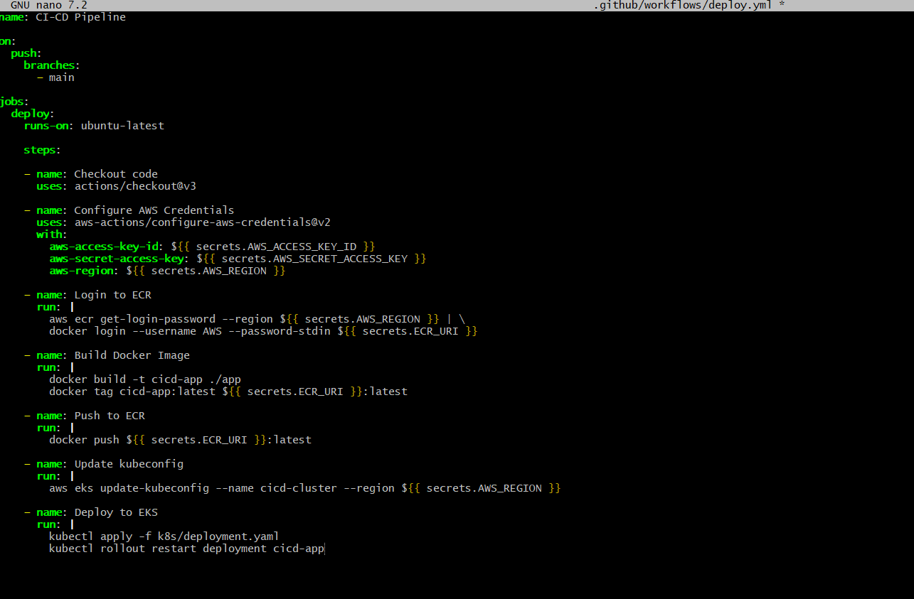

## Docker Build
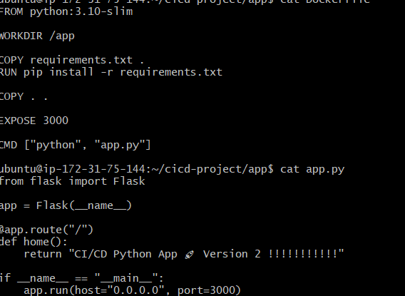

## Docker Container Running
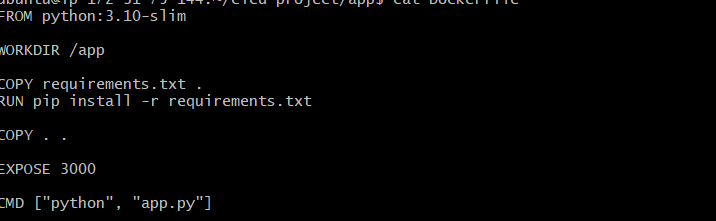

## AWS ECR Repository
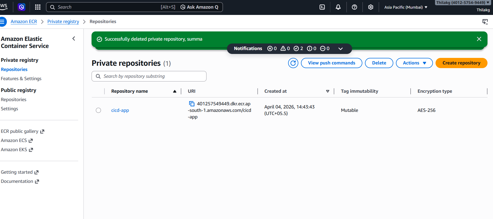

## EKS Cluster
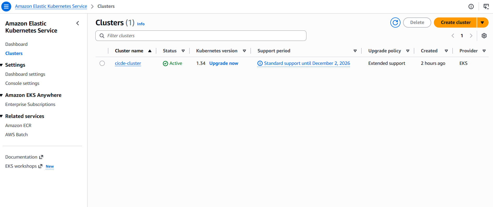

## EKS Cluster Creation (Terminal)
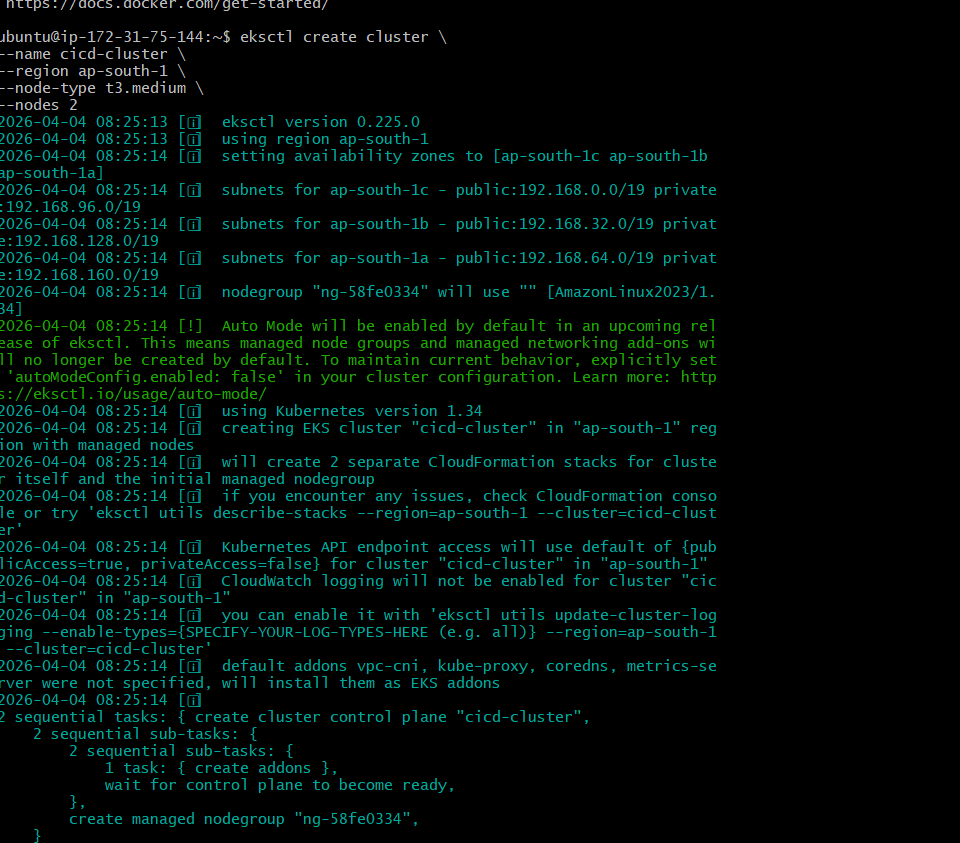

## EKS URL
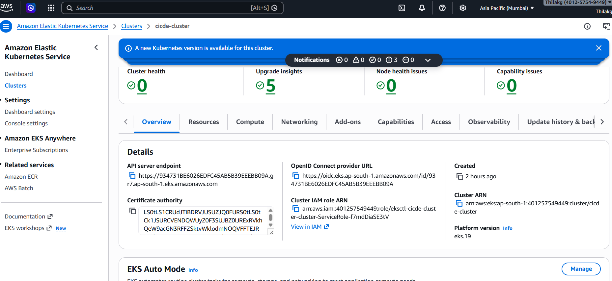

## Kubernetes Deployment 
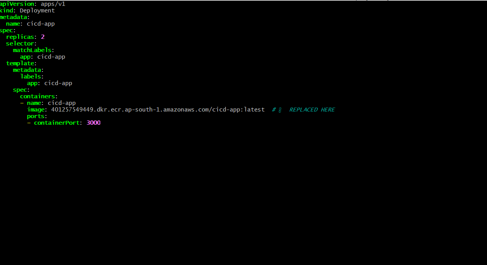

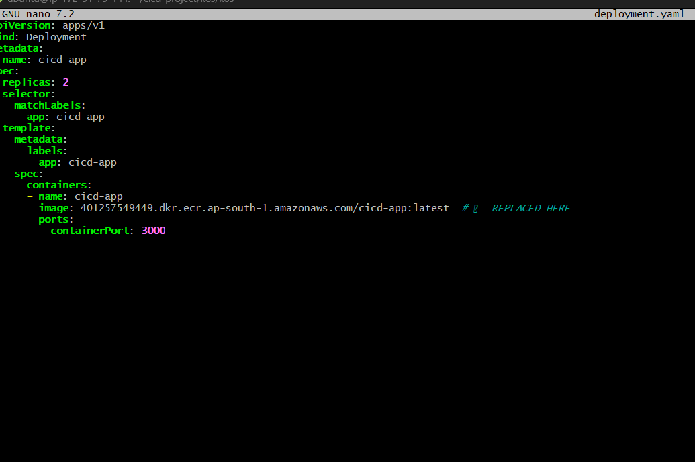

## CI/CD Workflow

1. Developer pushes code to GitHub
2. GitHub Actions pipeline triggers
3. Docker image is built
4. Image is pushed to AWS ECR
5. Kubernetes deployment is updated in EKS
6. Application is exposed via LoadBalancer


## Before CICD done

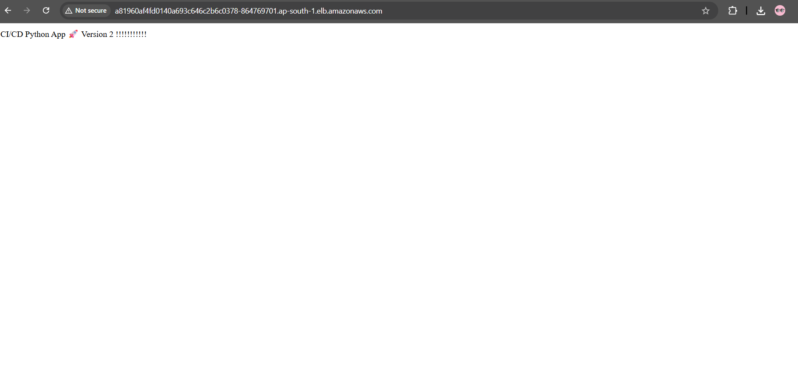

## After CICD done

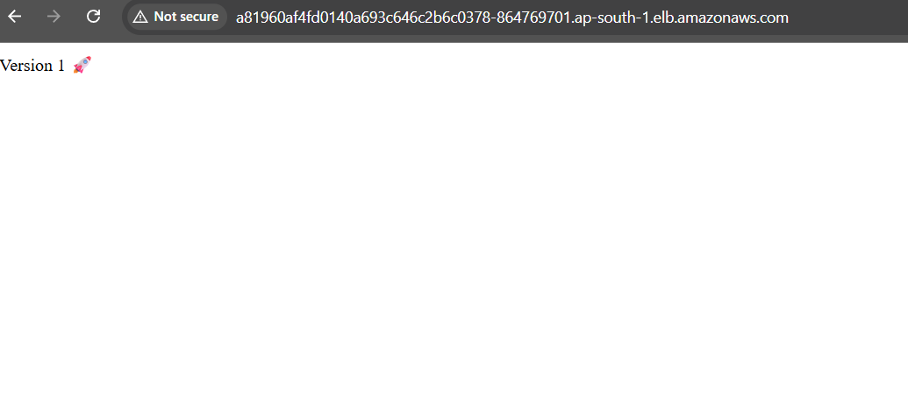

---
